# Project

This project includes the Storm class and Storm Chaser class. Code was written to calculate storm data from provided hurricane data, such as wind speed and pressure. It compiles data and information on storms, such as the data, duration, name, storm category, maximum wind speed, and minimum pressure.

* Code

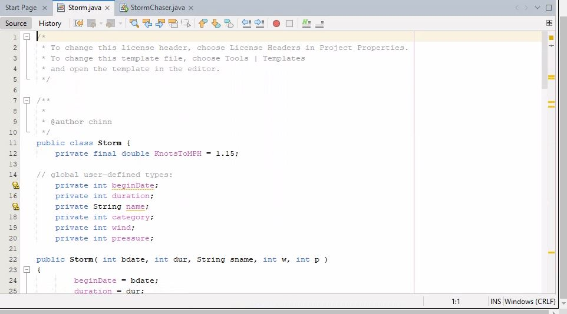
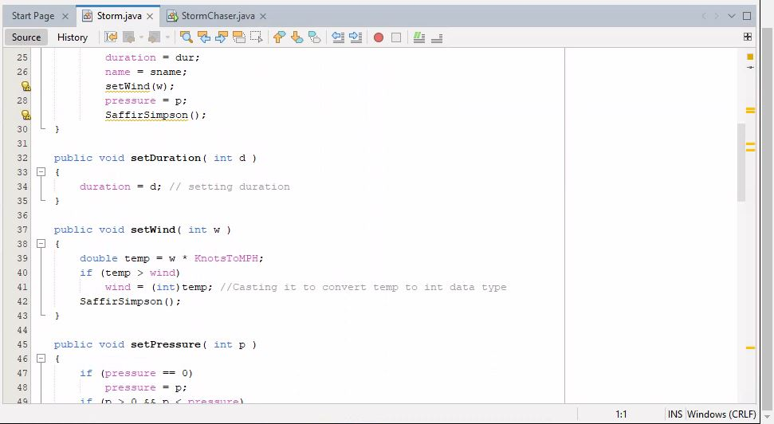
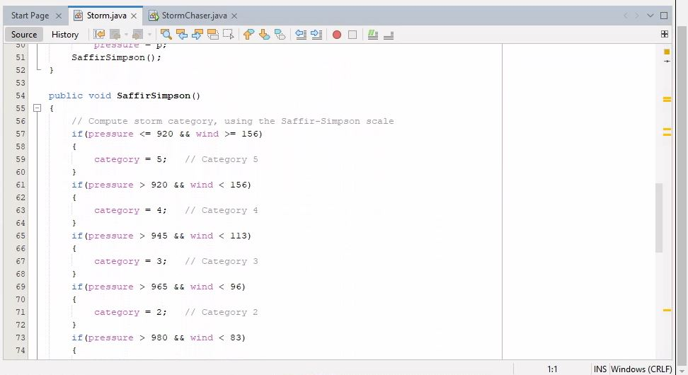
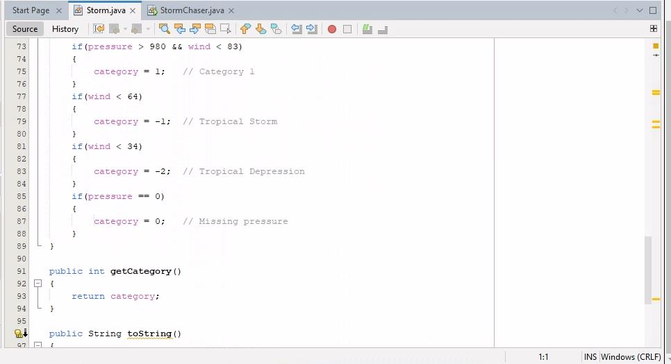
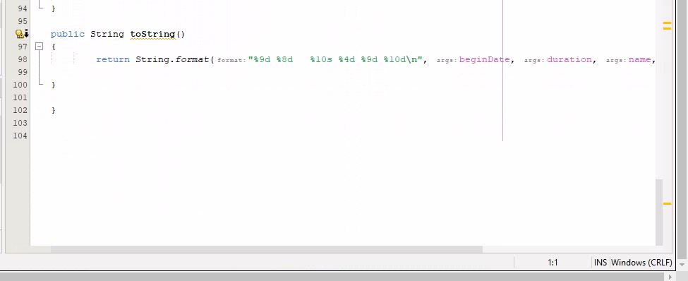
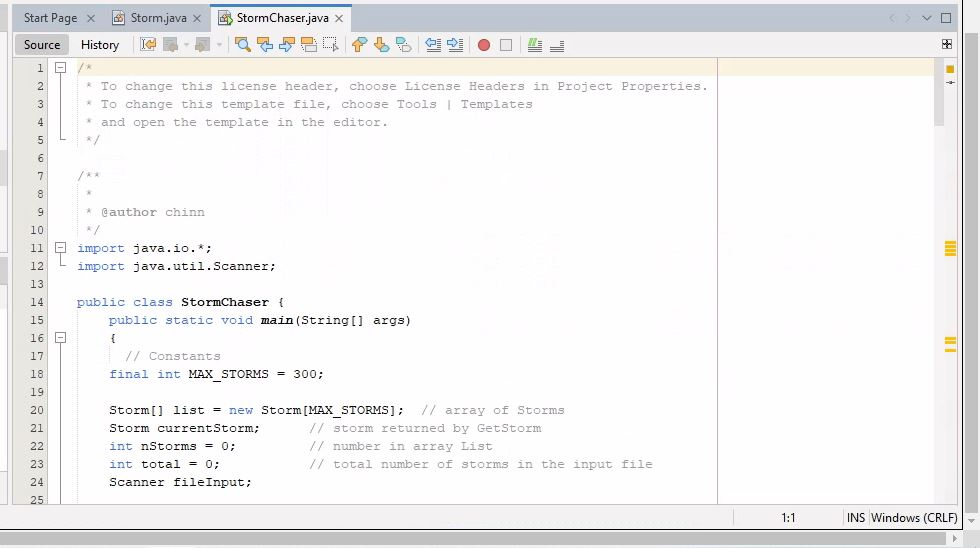
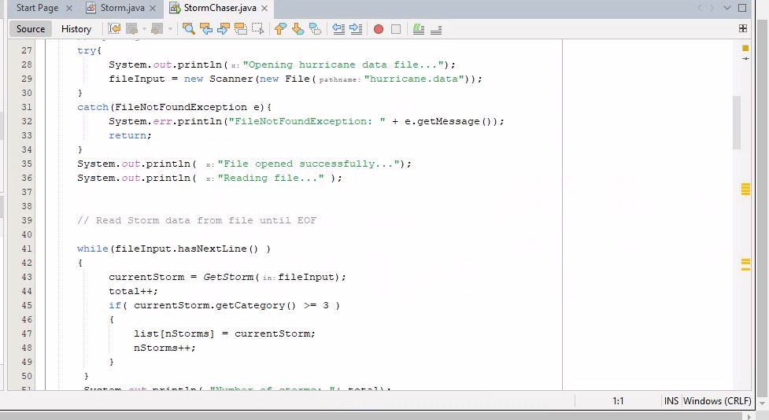
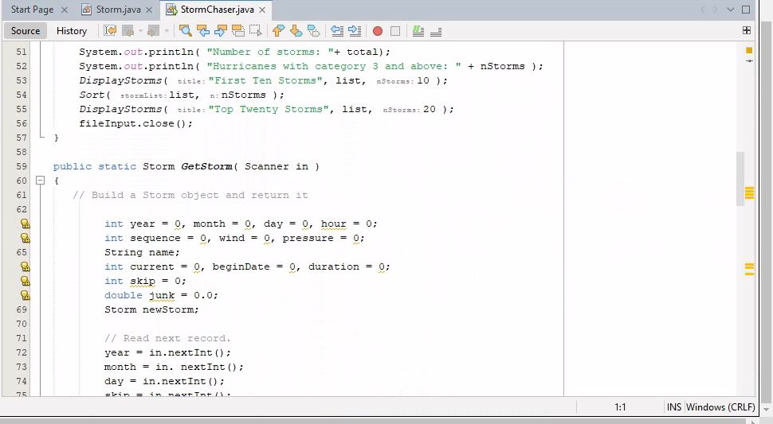
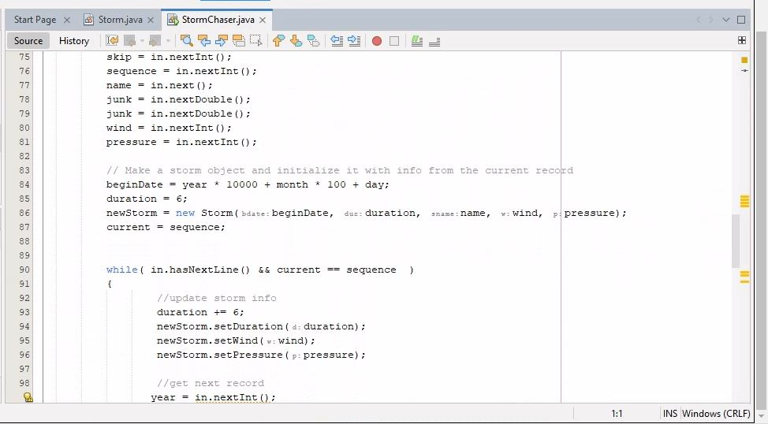
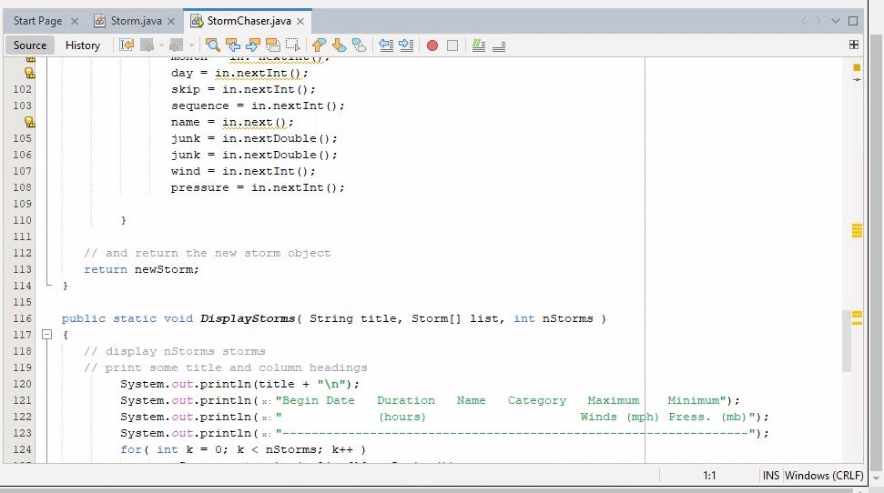
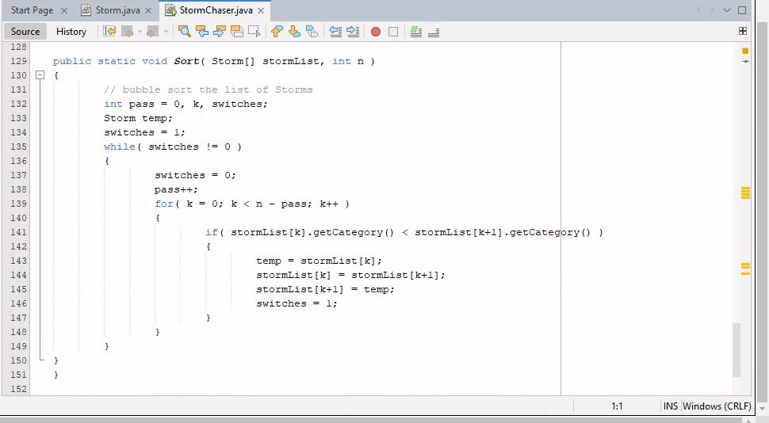

* Running the Code

