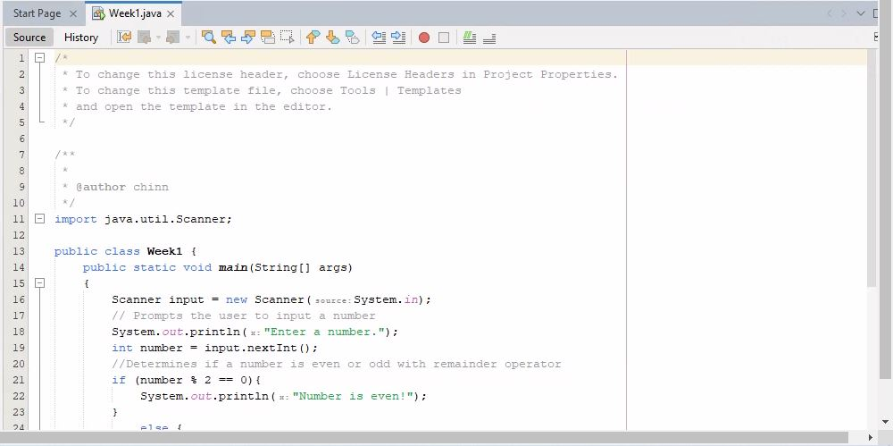
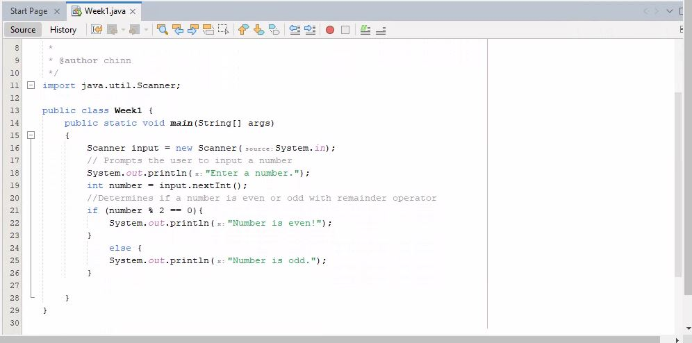
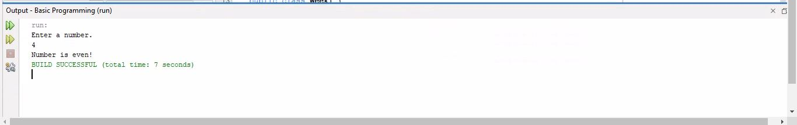
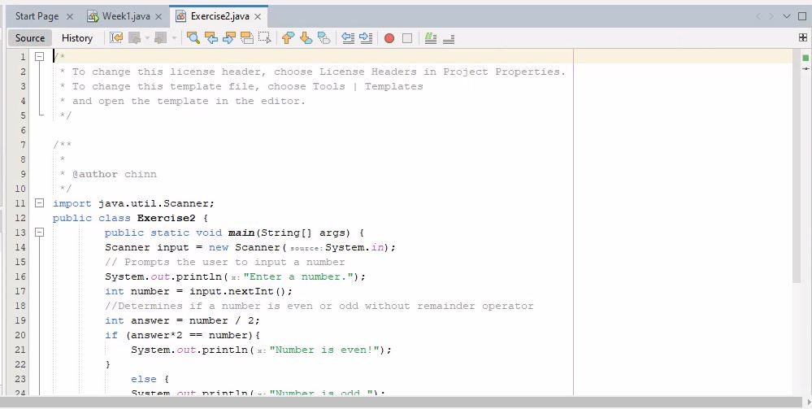
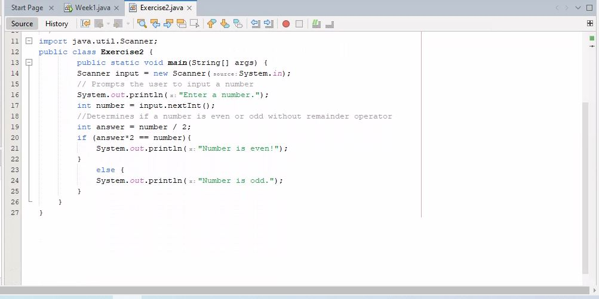
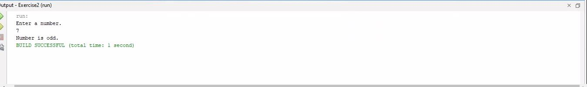
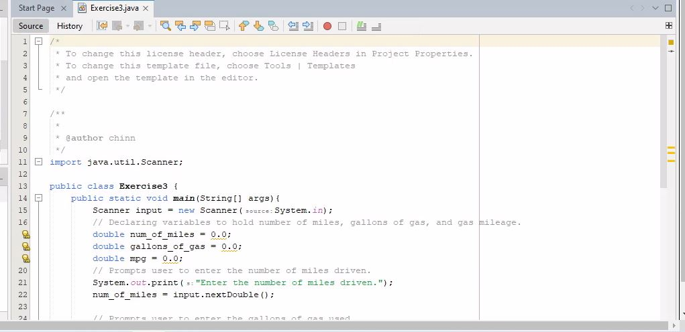
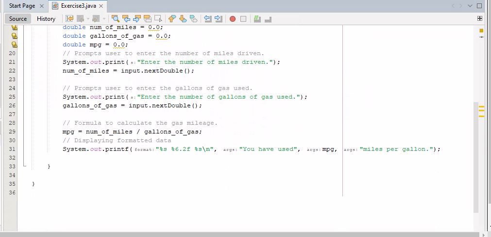
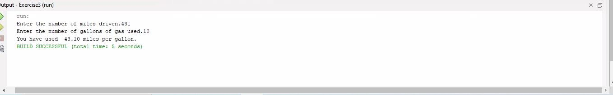

# Week 1 Java - Basic Programming

For this week, three projects in Java were created.

* Exercise 1
For the first one, I wrote a program that inputs an integer and displays if the number is even or odd, while using the remainder (%) operator.

* Exercise 2
I wrote the same program using another technique without using the remainder operator. This was done by using a selection if-else statement.

* Exercise 3
I wrote a program that calculates Gas Mileage.

