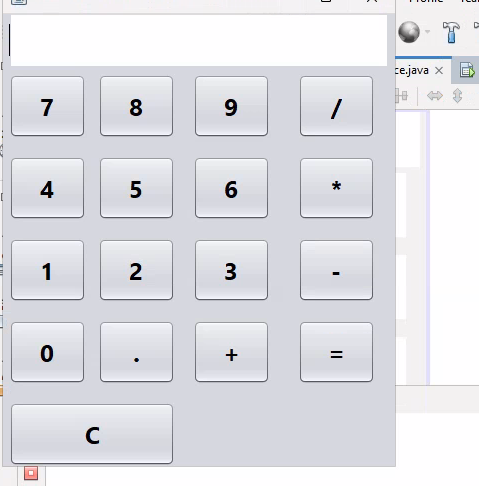
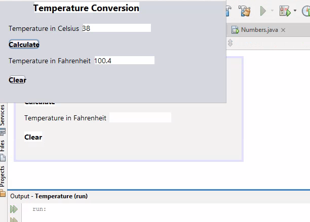
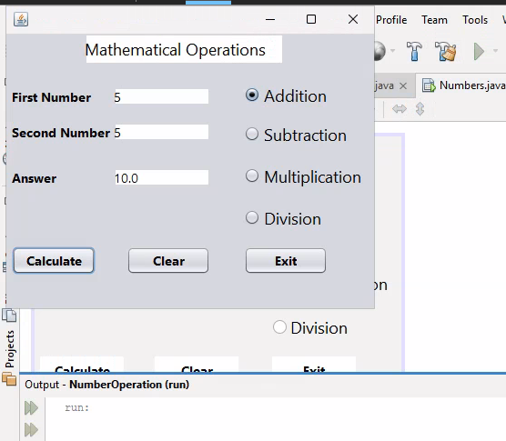

# Week 11 - GUI Components

For this week, three exercises were created using GUI components. For the first exercise, I created the GUI interface for a calculator of my own design. It only has the interface, not functionality. For the second exercise, I wrote a GUI version of the temperature conversion exerces. For the third exercise, I wrote a GUI program that inputs two numbers, then selects a mathematical operator (using a radio button). It is then calculated and displays the result in a textbox. The code is attached to a Word document.

* Exercise 1: Calculator Interface

* Exercise 2: Temperature Conversion

* Exercise 3: Mathematical Operator

