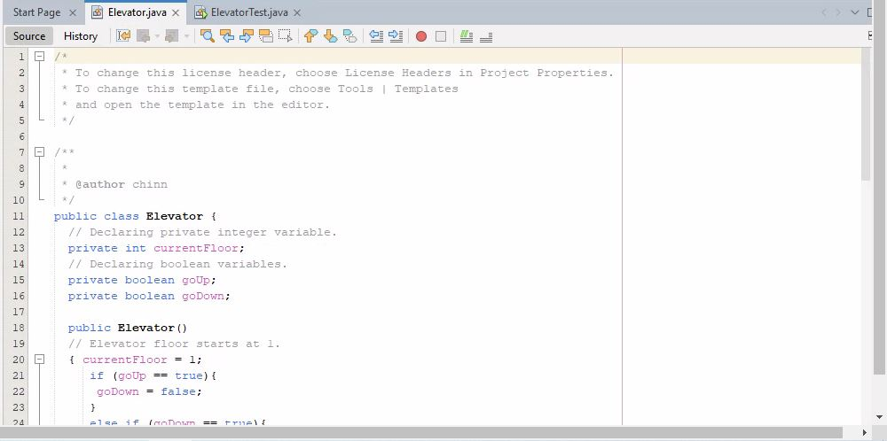
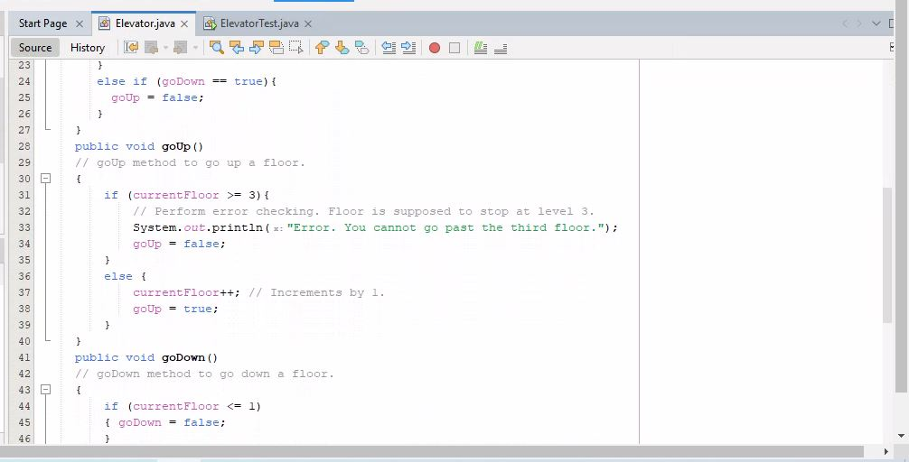
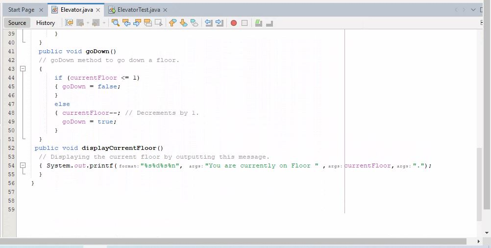
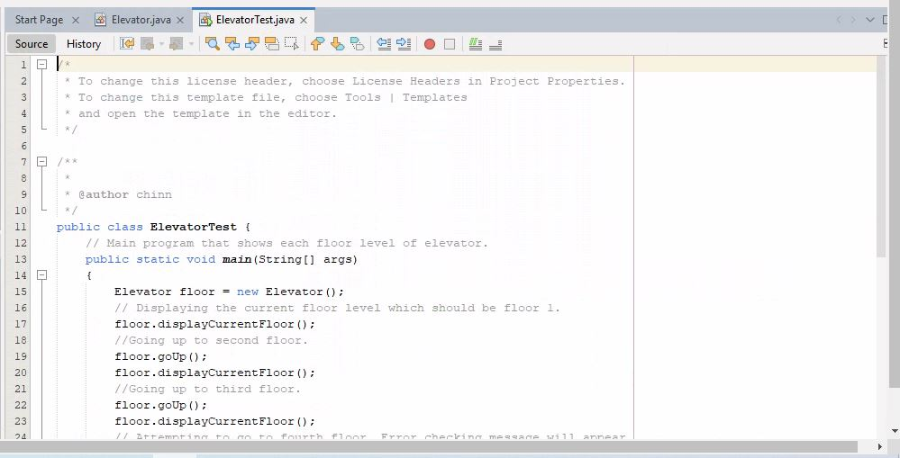
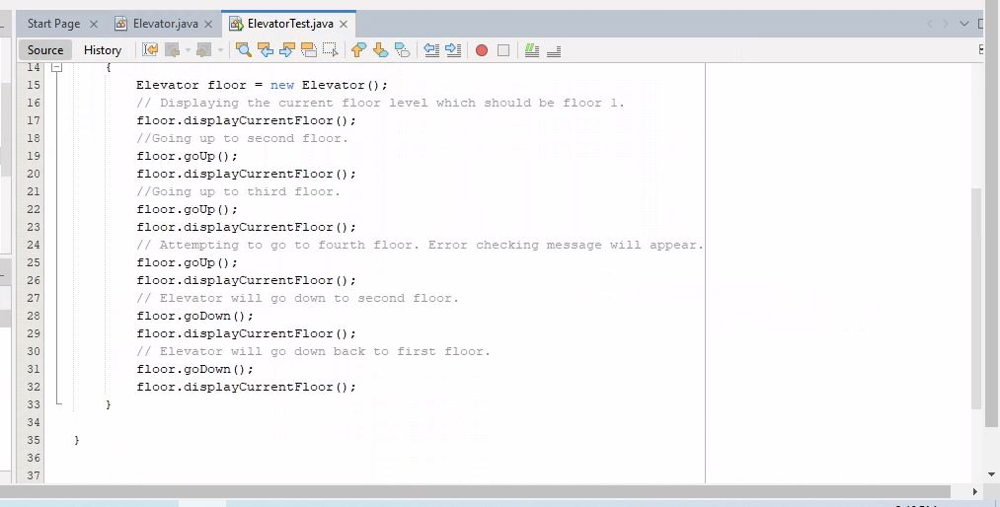
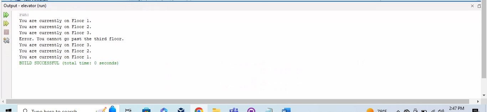

# Week 2 - Objects and Classes

I developed a program that simulates the operation of an elevator for a three story building. Code was written to make the elevator go up or down one floor at a time. The following parameters and conditions must exist in this program.

* The Elevator class should have one integer variable: currentFloor.
* The class should only need three methods: goUp(), goDown(), and displayCurrentFloor().
* The following steps must run:
	* Start on the first floor.
	* Go to the second floor.
	* Go to the third floor
	* Attempt to go to the fourth floor (Remember: there are only three floors)
	* Go back to the second floor
	* Go back to the first floor
	* Be sure to call displayCurrentFloor() to notify the user which floor the elevator is on at each step

# Elevator Code

# Elevator Test Code

# Running the Code

