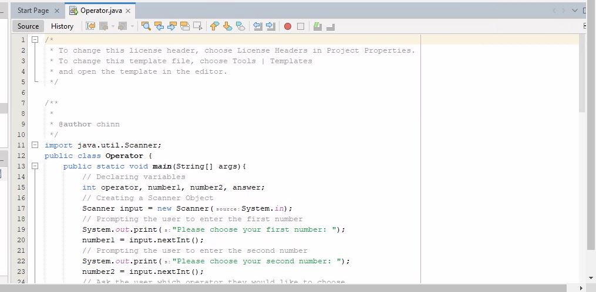
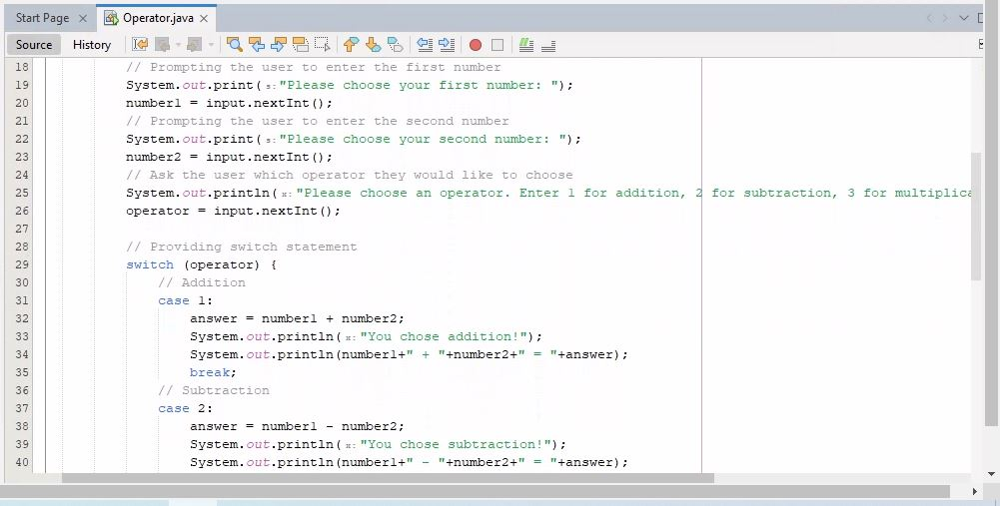
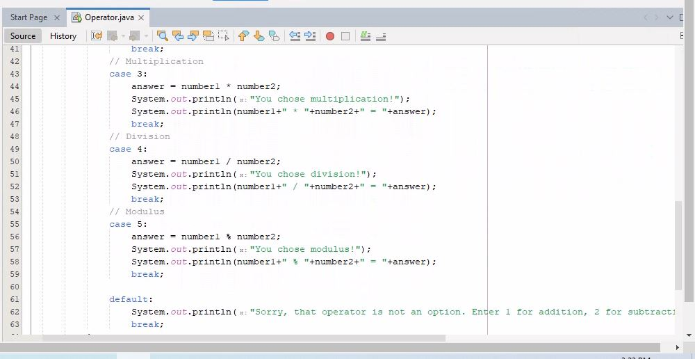
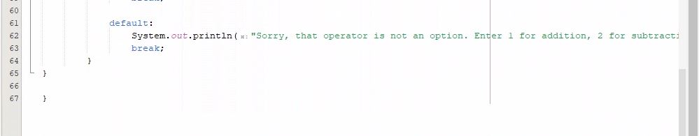
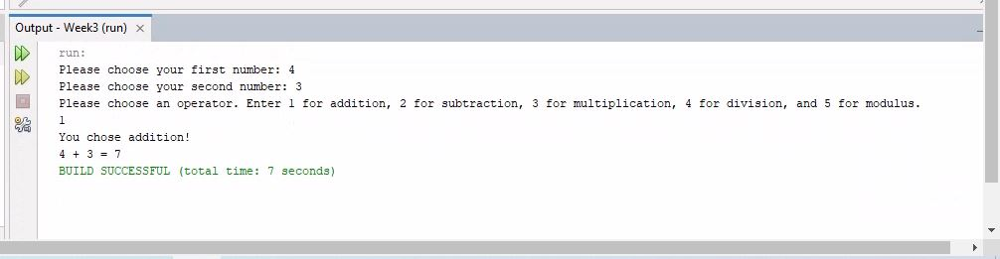
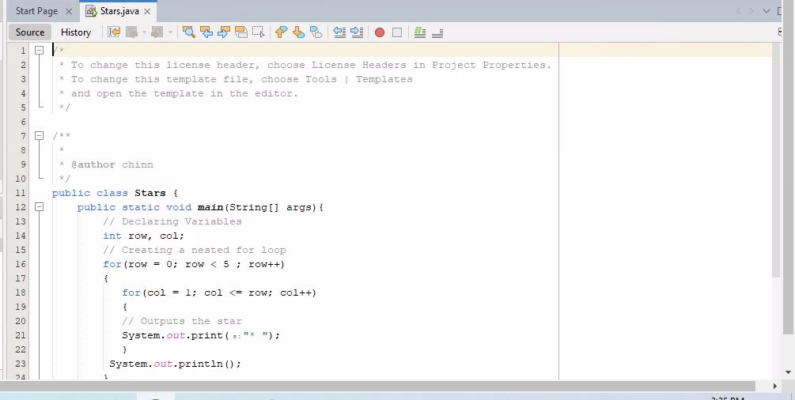
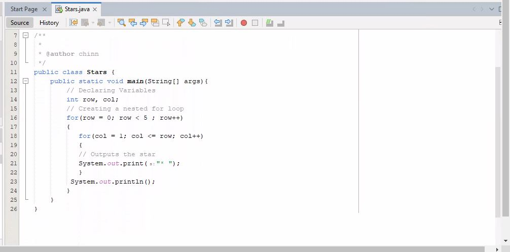
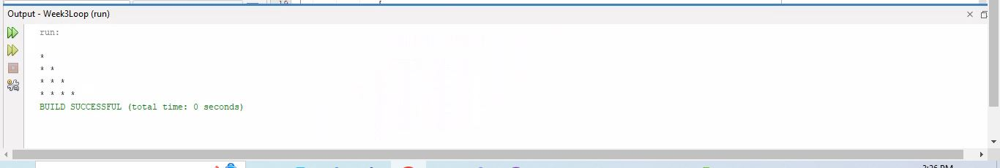

# Week 3 Control Statements

The following two programming exercises were completed using Java code.

* Exercise 1: I wrote a program that takes in two integer numbers and an operator. The switch function was implemented to successfully run the program. The output performs the appropriate calculation and displays the answer.

* Exercise 2: This program uses a nested for()loop to generate the following output.

