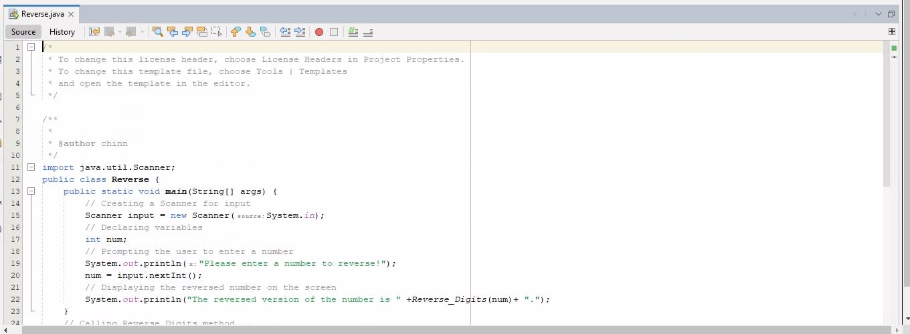
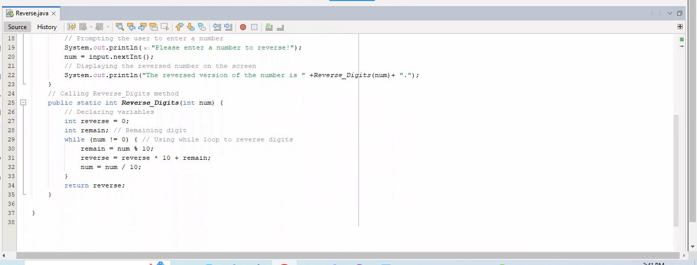
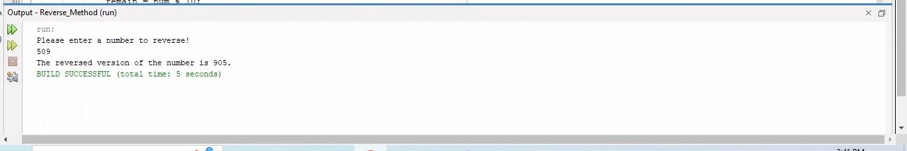
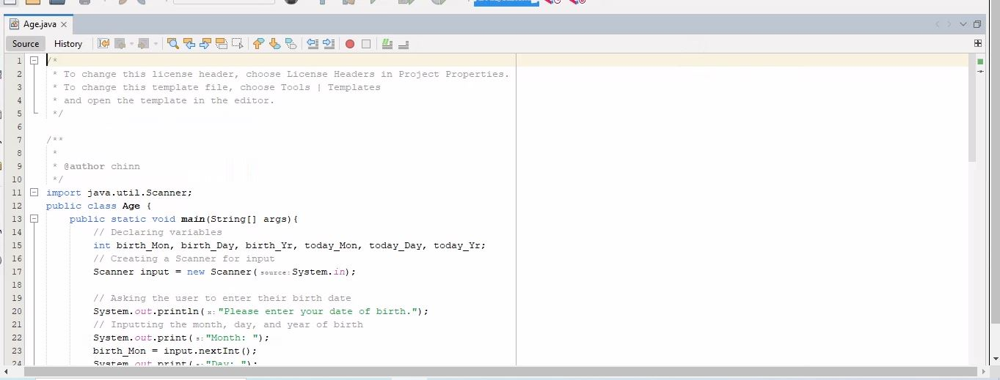
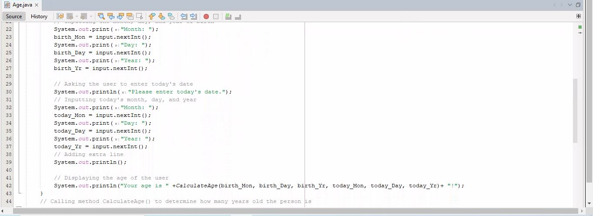
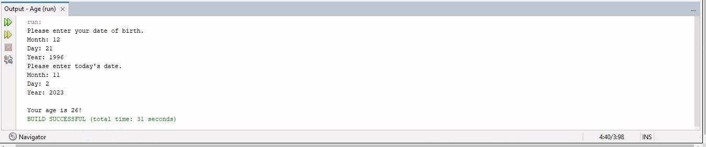

# Week 5 Methods

* Exercise 1: I wrote a program that takes an integer value and prints it with the digits reversed.

* Exercise 2: I wrote a program that inputs a person's birth date (month, day, year) and today's date (month, day, year). It is then calculated to display the age.

