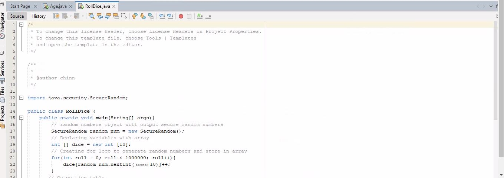
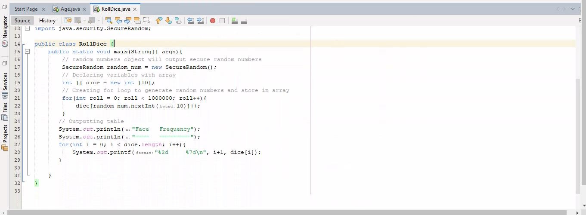
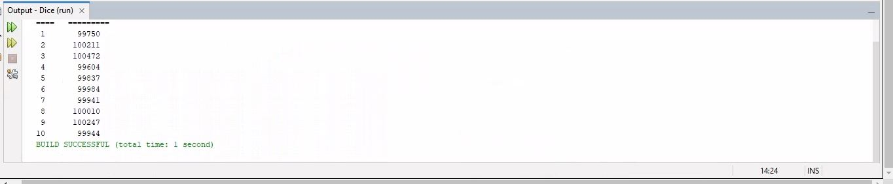
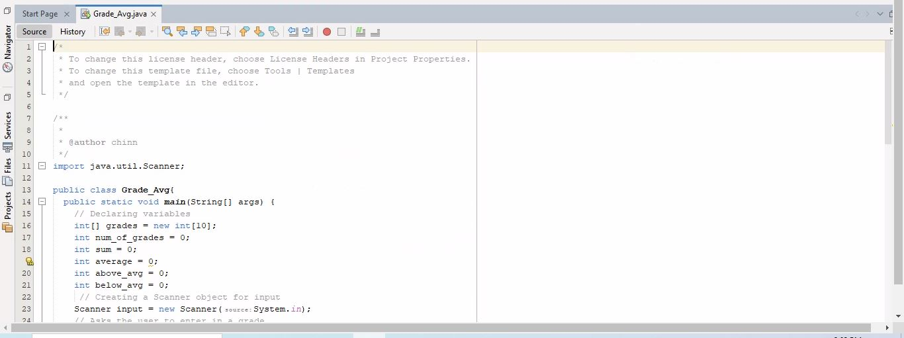
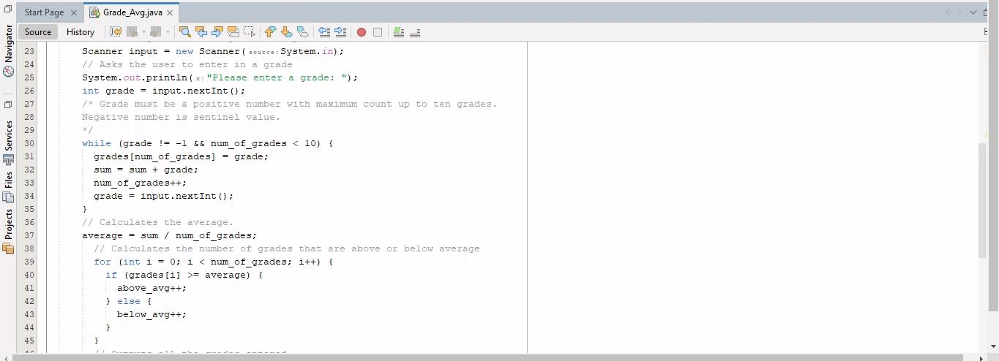
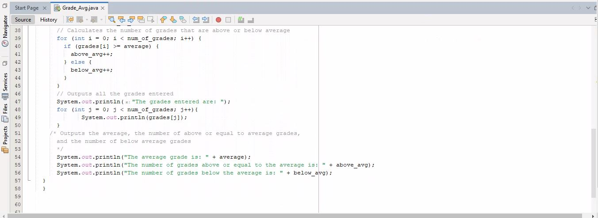
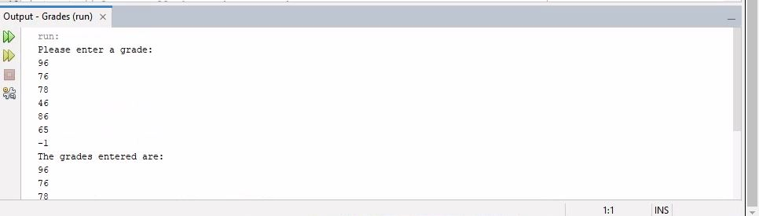
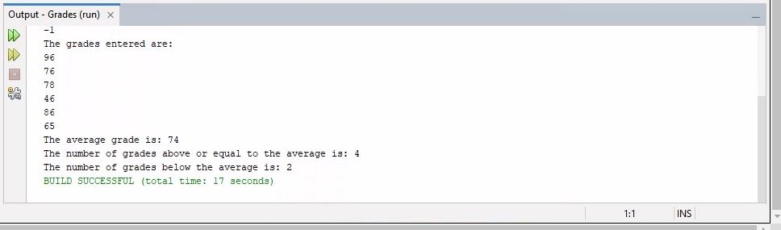

# Week 7 - Arrays and Strings

For this week, two exercises were programmed that make use of arrays and strings.

* Exercise 1: Using a random number generator (hint: SecureRandom), simulate the roll of a 10-sided dice
(numbers between 1 and 10). Using an array of integers, keep track of the frequency each value is
generated. Using a for() loop roll the dice 1,000,000 times.

* Exercise 2: This program reads an unspecified number of grades (no more than 10) and determines how many are above or equal to the average and how many are below. Then I print out the entire array so I can verify the result, and I use a negative number as a sentinel value.

