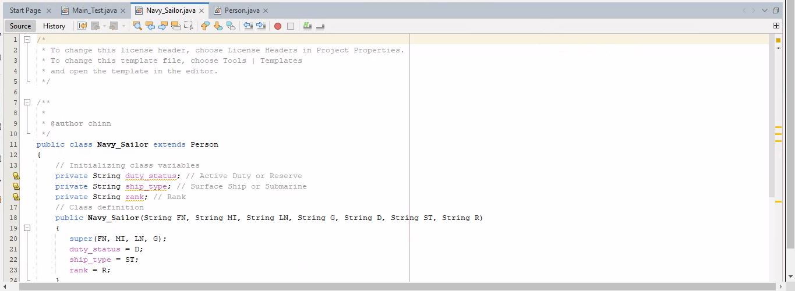

# Week 9 - Objects and Classes: Inheritance

For this week, a class definition is created for a Person and for a Navy Sailor that inherits (extends) the properties of a Person. At each level, class variables are created for the Person class and Navy Sailor class. Each object must be created at the lowest level (Navy Sailor) and initialized for the bottom up. A short main() program was created to test it out.

* Inheritance Code

* Running the code

